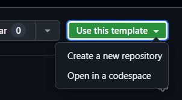
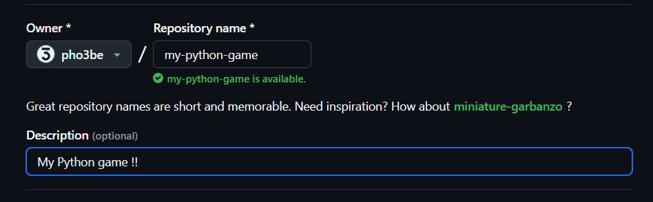
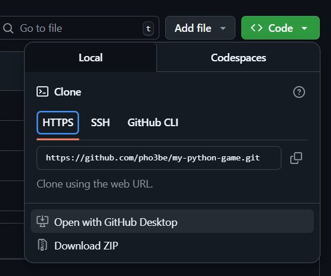

# Welcome to PythonExtra for ClassPad

This is a simple starting point for creating Python programs for the ClassPad II (fx-CP400) using **PythonExtra**, a lightweight version of MicroPython built for calculators.


## 🐍 What is Python?

Python is a popular programming language known for its simplicity and readability. It's widely used for teaching, scripting, automation, game development, and much more.

Here’s a simple Python example:

```python
print("Hello, world!")
```

If you're new to Python, no worries—this project is built to help you learn by doing.

> New to Python or the ClassPad?
> Start here:
>
> 👉 [Beginner Guide to PythonExtra](https://classpaddev.github.io/wiki/python/introduction)


## Quick setup

First, use this repo as template :



If you just want to quickly test something, go with "Open in a codespace".

If you want to create a project, choose "Create a new repository"


### Create a new repository
Give your repo (project) a name, and a cool description :



Then wait for it to be generated.

Then, choose 'Code' (the green button) and "Open with GitHub Desktop" :



If you don't have already, get the [GitHub Desktop](https://desktop.github.com/download/) and [Visual Studio Code](https://code.visualstudio.com/Download)

If you don't want / can't install anything on your PC, then go to the "Codespaces" tab and choose "Create codespace on master", then jump to `Use a codespace`

On the "clone a repository popup", just click "Clone".
Wait for it to finish, then choose "Repository" > "Open in Visual Studio Code"

If prompted "Do you trust the authors", select yes. We do :) .

Finally, open the "bounce.py" and start writing some code, or create your own file and have fun !

### Use a codespace

If you just opened the codespace, you should be looking at this file right now ! Congrats, you can now create your own python file or look at `bounce.py`.

When prompted "Do you want to install the recommended 'Python' extension from Microsoft for the Python language?", click "yes".

It's important, otherwise some nice features won't work.

## Install to the calculator

Mount your classpad to your PC as USB storage device and copy the `bounce.py` (or your program) to the calculator.

Then, go into the HollyHock Launcher (under System, in the menu) and search for the PythonExtra addin.

Run in, and on the "Files" pane (using the `=` button) look for your python file. You can navigate using the arrow and enter a folder using `EXE` key.

Press `EXE` to run it, and you should have the bouncing logo or your program working !

## First steps

When writing to the calculator, all your Python programs must start with:

```python
import gint
```

This gives you access to the core graphics and input functions available on the calculator.

### What is gint?
`gint` is the main module that powers **drawing**, **keyboard input**, and graphics control in PythonExtra.

You use it for:

- Drawing shapes and pixels (`gint.dpixel`)

- Reacting to key presses (`gint.pollevent()`)

- Controlling the screen update (`gint.dupdate()`)

Here’s a very simple example that draws a **blue rectangle** on screen:

```python
import gint

# Clear the screen with white color
gint.dclear(gint.C_WHITE)

# Draw a filled blue rectangle from (50, 50) to (150, 100)
gint.drect(50, 50, 150, 100, gint.C_BLUE)

# Send drawing to the screen
gint.dupdate()

# Wait for a key press to exit
gint.getkey()
```

> Read more:
>
> 👉 [Beginner Guide to PythonExtra](https://classpaddev.github.io/wiki/python/introduction)
>
> 👉 [gint module reference](https://git.planet-casio.com/Lephenixnoir/PythonExtra/src/branch/main/docs/sh/modgint-en.md)

## 💬 Need Help?

- 🧠 Ask ChatGPT:
    [PythonExtra Helper on ChatGPT](https://chatgpt.com/g/g-67fb8fb50e2c8191a7df1b814ad8fce9-pythonextra-helper)
- 💬 Ask real people on Discord: 
    [SnailMat Server (ClassPad Club)](https://discord.gg/jZQWY9DBKT)

## Project Structure
This repo contains:

- `bounce.py`: A simple boucig logo example (start here!)

- `gint.py`: Simulator (using pygame) to test you game locally

- `.typings/` and `.vscode/`: are settings folder for PythonExtra to work on VS Code. Do not delete them.

- `/` and `.vscode/`: are settings folder for PythonExtra to work on VS Code. Do not delete them.


When deploying to your calculator, you only need to copy your code (`bounce.py`, the file you created etc).

> Do NOT copy `gint.py` to your calculator, nor the ".typing" nor "tools" nor "_data". All of that is only useful when debugging locally.

## Debugging locally

If you have the `gint.py` file in the same place than your code (`bounce.py`), you can try to run or even debug it with visual studio (or your favorite IDE)

You'd need pygame installed, you can do it with `pip install -r requirements.txt`

If using VS Code, you can simply place breakpoint on your code (`bounce.py` for example) and press "F5", and choose "Python Debugger" then "Python File".


## Try Drawing Code Online

Want to quickly test simple drawing code (like `gint.drect`, `gint.dpixel`, `gint.dcircle`, etc.)?

You can use the **PythonExtra REPL** (beta) here:

🧪 [python-extra-repl](https://therainbowphoenix.github.io/python-extra-repl/)

> ⚠️ **This REPL only supports drawing commands.**
> Input functions like `gint.getkey()` or `gint.pollevent()` won’t work in the REPL. Avoid infinite loops like `while True:`.