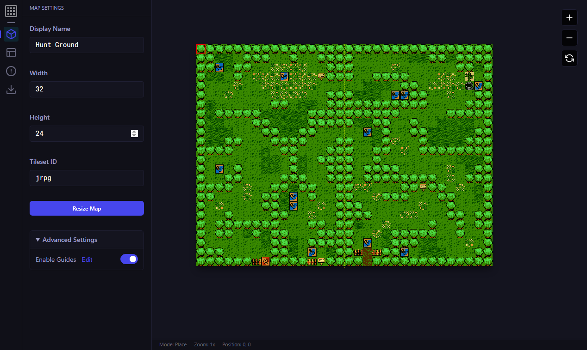
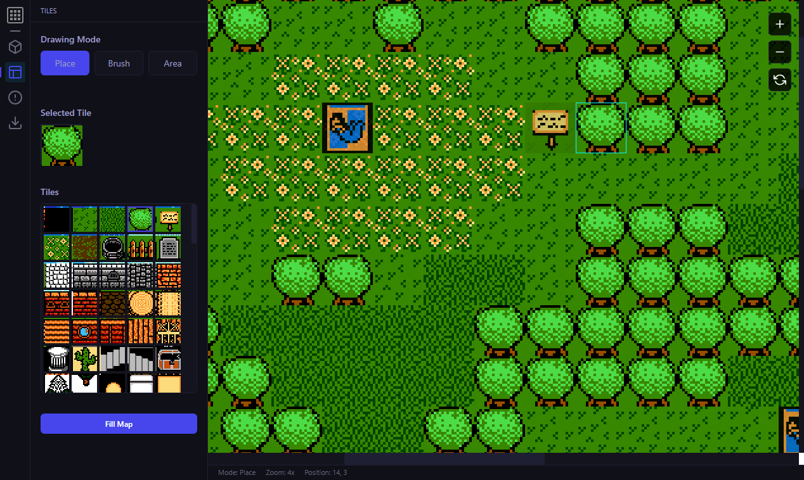
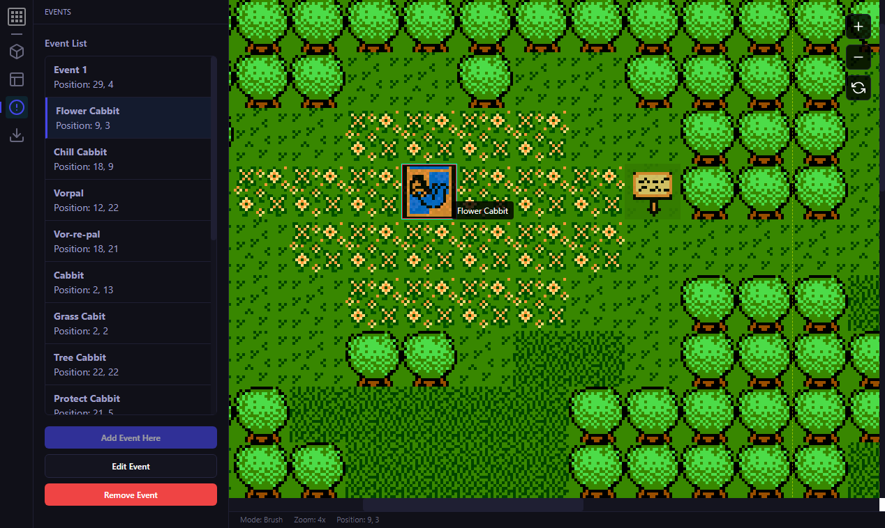
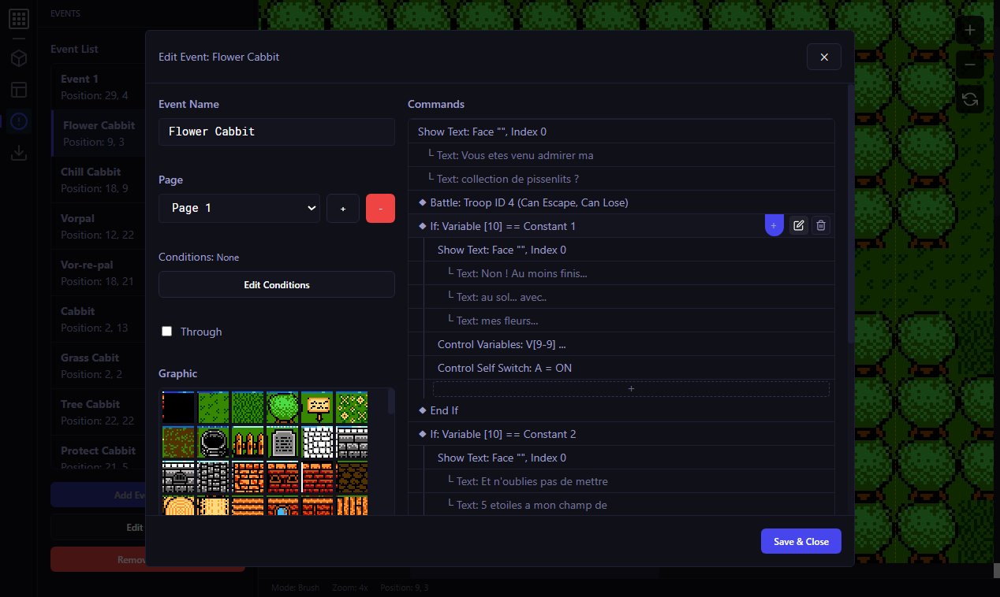
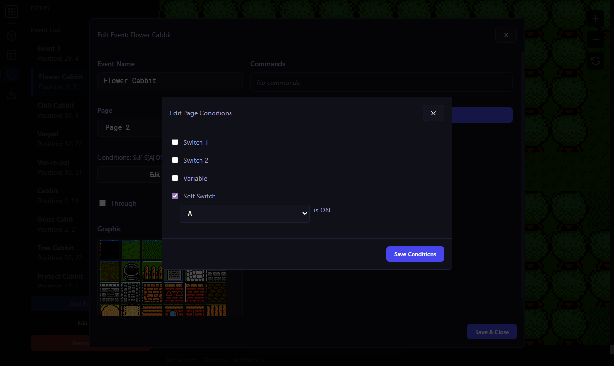
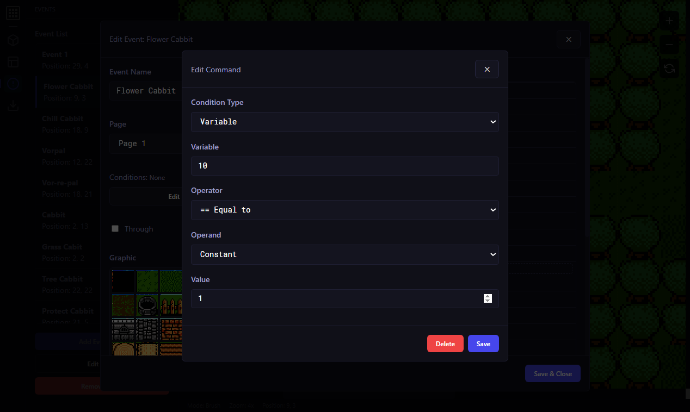
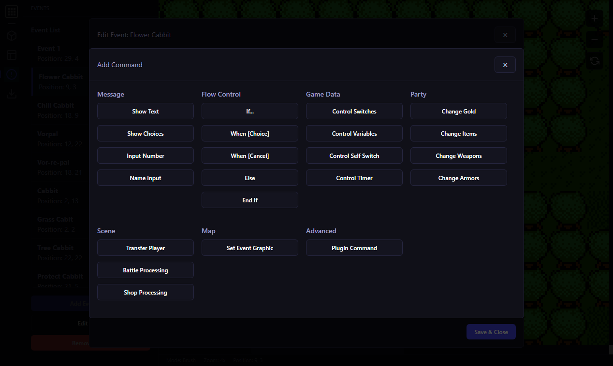
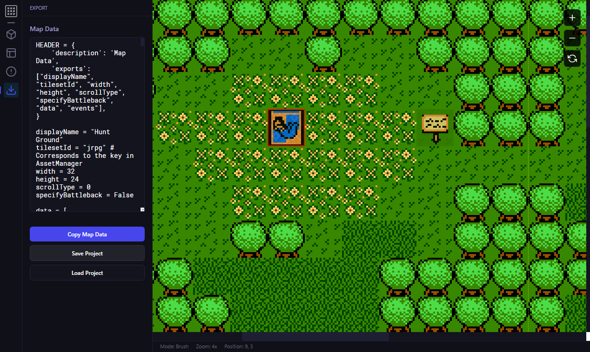

# JRPG Map Editor

This template should help get you started developing with Svelte and TypeScript in Vite.

# Features

## Map settings

Change the name, width/height, tileset, resize the map, and customize the guides

## Tiles

Place tile one by one, using a paint brush, or rectangle area selection. 

Preview for the selected tile from palette

Canvas have zoom controls, current painting mode, and (X,Y) position of the hovered tile 

## Event

View, add, edit and remove events.

Can click on the list to select the event on map. Useful cursor hint to show the event name.

### Edit Event

Change event name, pages (one page = one set of commands), conditions for the page to be executed, player walk through tile, and its displayed graphic for the page on map.

Each page have their own conditions and are executed in reverse order, so the last one will be checked first for conditions, and so on till the first one, stopping at the first one that's true.

Commands are executed in the top-down oder, you can hover one to edit/delete/add one before it.
Double click on item name also works.

### Edit Condition

Each Page have their own display conditions

### Edit command

Each command have their own config, that you can change and tweak double clicking it.

### Add command

You can pick which command you want to add :

## Export to map

Finally, you can export to python map or load/save the current project

## Dev setup for the Editor

Use [VS Code](https://code.visualstudio.com/) + [Svelte](https://marketplace.visualstudio.com/items?itemName=svelte.svelte-vscode).

Get [Deno](https://deno.com) and from this folder do `deno run dev`

Build for prod, do `deno run build`
